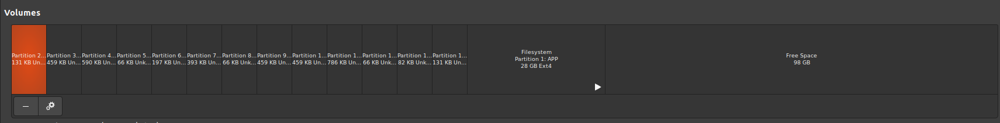

# OStoISO (for GPT disks)
To turn any storage device into an ISO, it is usually as simple as calling `dd if=/dev/sda of=/path/to/my.iso` (https://stackoverflow.com/questions/56900639/creation-of-os-image-in-iso-format). This goes for hard drives with operating systems as well.

However, take the following case:

Here, there are **tons** of free space. If you tried to do the method described above, you would have a 126GB .iso file. Not only is this an inefficient amount of space, but it prevents you from using the ISO on smaller disks. To solve the issue, here's what I did.

### Process
For this scenario, all you have to do is cut off the empty part in the .iso file. However, due to GPT partition tables having a backup table all the way at the back, you must include extra space in order to reconstruct it later. Without this, the disk you restore the image on will be unable to be recognized as a disk due to it having a cut off GPT backup table. While there are many methods of doing this, I found the following the easiest for me:

1. Use `sudo fdisk -l` to determine the very last sector right before the free space.
2. Create a temporary .raw file (extension doesn't mean anything; It's just to hold raw disk data) of the disk via `sudo dd if=/dev/sda of=mydisk.raw count=[last sector + 34] status=progress`. You MUST add, at minimum, 34 more sectors in order to include space for the backup GPT table for later (see https://superuser.com/questions/1081623/shrink-total-disk-image-uefi-gpt-flashdrive-freespace-at-end for details)
3. Using `gdisk`, call `sudo gdisk mydisk.raw` in order for the tool to detect your broken table. After that, press `w` then `enter` at the command prompt in `gdisk` and it should fix the table for you. 
4. You know how a fully working GPT bootable operating system on a .iso file.

### Alternative Methods
There are various other ways of doing this exact same thing with extra steps. Generally, this method seemed the most popular online:

1. Create a .iso file of the ENTIRE disk you want to use via `sudo dd if=/dev/sda of=mydisk.iso status=progress`
2. Mount it as a loop device so are able to mess with the .iso file.
3. Using `gparted` (or similar), shrink the partition .iso file until you reach the desired size.
4. Save the .iso file.
5. Use the `truncate` tool to truncate the file, leaving 34 sectors or more of free space at the end (for the GPT backup table)
6. Using `gdisk`, call `sudo gdisk mydisk.raw` in order for the tool to detect your broken table. After that, press `w` then `enter` at the command prompt in `gdisk` and it should fix the table for you as it rewrites it. Should this change in the future google appropiate command. 
7. You know how a fully working GPT bootable operating system on a .iso file.

Others suggested using a tool made for a similar task, but overall using those methods required the same steps in the long run. 

### LiveCD's
In case you didn't know, LiveCD's are usually constructed with both MBR and GPT partition tables; A "hybrid" disk. However, the GPT partition table only contains the EFI partition and that's it: there is no need to rebuild the GPT partition table. You can simply cut off the excess and be perfectly fine (as long as you don't cut any partitions).

There is one notable exception: Any auto-extended writable partitions. Those will behave a bit strange. If you use a tool like `xorriso` to try to copy the file structure of this cut ISO into a new one, the auto-extended partition will be written, resulting in the new ISO having the exact same size as the USB it was read with. You can obviously still trim it down, but it's still an annoying issue. The best way to solve this is to simply copy the `squashfs` filesystem that holds the actual data and replace it with that of a known good LiveCD ISO. 

If you really do need to rebuild the partition table so that MBR and GPT are included, you can possibly follow https://superuser.com/questions/961312/how-to-create-hybrid-live-usb. 

